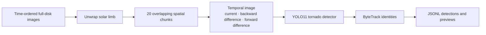

# Development of a Neural Network Tracker For Solar Magnetic Tornadoes​

A computer-vision pipeline for detecting and tracking solar magnetic tornadoes in AIA 171 Å image sequences.  
Authors: Vladimir Ganzhara (HSE, Moscow), Mark Blumenau (HSE, Moscow), Olga Khabarova (University of Luxembourg, Luxembourg).  
Presented at COSPAR 2026.


## Pipeline



The temporal representation is a three-channel image:

- channel 0: the current grayscale frame;
- channel 1: absolute difference from the previous frame;
- channel 2: absolute difference to the next frame.

At sequence boundaries, or when adjacent frames are more than 120 seconds apart, the missing neighbour is replaced with the current frame. Its difference channel is therefore zero.

## Repository contents

```text
.
├── inference.ipynb             # full disk/limb strip → chunks → detections and tracks
├── training.ipynb              # labeled sequences → temporal dataset → YOLO training
├── models/
│   └── temporal_model.pt       # fine-tuned one-class detector
├── requirements.txt
└── README.md
```

The supplied checkpoint contains one class: `tornado`.

## Quick start

Create an environment and install the notebook dependencies:

```bash
python3 -m venv .venv
source .venv/bin/activate
python -m pip install -r requirements.txt
jupyter lab
```

Open `inference.ipynb`, set `INPUT_DIR`, and choose one input mode:

- `INPUT_KIND = "full_disk"` unwraps each full-disk image into a limb panorama;
- `INPUT_KIND = "limb_strip"` starts from an existing boundary/limb panorama.

Input files must form a time-ordered sequence. The preferred AIA-style filename is:

```text
aia.lev1_euv_12s.2019-01-01T000012Z.171.image_lev1.png
```

Any filename containing a timestamp formatted as `YYYY-MM-DDTHHMMSSZ` is accepted.

Inference writes one JSON object per frame and limb segment to `artifacts/inference/predictions.jsonl`. Each record contains the source timestamp, segment ID, bounding boxes, confidence scores, class IDs, and ByteTrack IDs.

## Training data

`training.ipynb` expects labeled, already-chunked grayscale sequences in standard YOLO detection layout:

```text
data/source_dataset/
├── images/
│   ├── train/
│   │   └── 2019-01-01T000012Z_0.png
│   └── val/
└── labels/
    ├── train/
    │   └── 2019-01-01T000012Z_0.txt
    └── val/
```

Chunk filenames are `<timestamp>_<segment_id>.png`. Frames sharing a segment ID are sorted by time and treated as a sequence. Labels use normalized YOLO rows:

```text
class_id x_center y_center width height
```

Split complete events or observing intervals between training and validation before running the notebook. Splitting adjacent frames at random leaks nearly identical images into validation and overstates performance.

## Geometry and defaults

| Setting | Value |
|---|---:|
| Panoramic limb width | 12,638 px |
| Limb band height | 384 px |
| Chunks per panorama | 20 |
| Chunk width | 768 px |
| Maximum temporal gap | 120 s |
| Detector input size | 768 px |
| Tracking backend | ByteTrack |

The final chunk wraps around to the beginning of the panorama, preserving coverage at the angular seam. Keep these constants aligned between training and inference.

## Notes

- The model is a YOLO detector trained on temporal composites.
- Full-disk limb estimation is automatic but should be visually checked. Set an explicit center and radius in the inference notebook when automatic disk fitting is unreliable.

## License

TBD.
